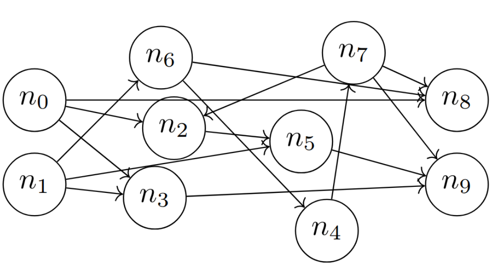
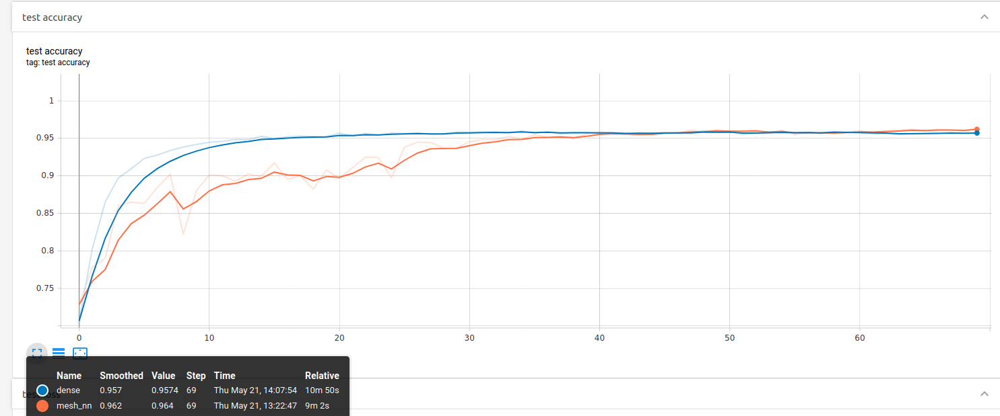

## Mesh Neural Networks

This repository contains a Tensorflow 2.1 implementation of Mesh Neural Network, based on article [Formal derivation of Mesh Neural Networks with their Forward-Only gradient Propagation](https://arxiv.org/abs/1905.06684).


#### Overview
Unlike [feed-forward neural network](https://en.wikipedia.org/wiki/Feedforward_neural_network), grouping neurons by layers, where only neighboring layers are connected,
mesh neural networks represents network as a weighted graph, where all neurons (except input ones) are connected densely. 



#### How to run

This repository contain two train scripts on MNIST: 
one for mesh neural network
```bash
python3 train_mesh_nn.py
```
and one for feed-forward neural network
```bash
python3 train_dense.py
```

Both scripts are constructed to have the same hyperparameters and more or less the same networks complexity.
Training process could be watched via tensorboard:
```bash
tensorboard --logdir logs
```



#### Requirements
* tensorflow == 2.1
* numpy >= 1.12.0